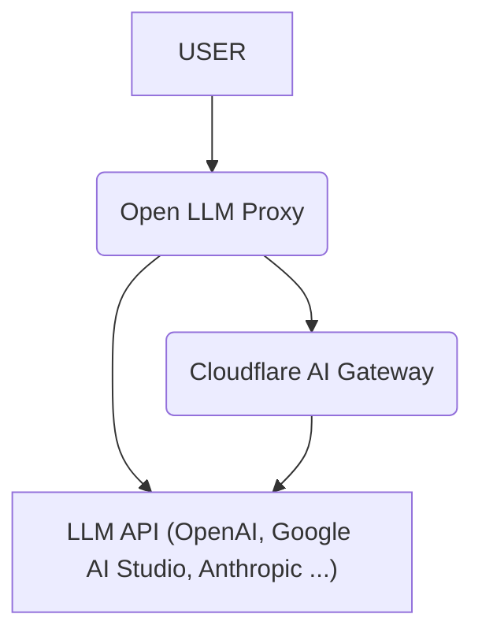

# Open LLM Proxy — Multi-Tenant LLM Gateway on Cloudflare Workers

This is a serverless, multi-tenant LLM gateway built on [Cloudflare Workers](https://www.cloudflare.com/developer-platform/products/workers/) that integrates with multiple Large Language Model (LLM) APIs. Inspired by [LiteLLM](https://github.com/BerriAI/litellm) and [llm-proxy-on-cloudflare-workers](https://github.com/blue-pen5805/llm-proxy-on-cloudflare-workers.git).

> This project branched from and borrows heavily from [llm-proxy-on-cloudflare-workers](https://github.com/blue-pen5805/llm-proxy-on-cloudflare-workers.git). We are deeply thankful to the original authors. It has since evolved into a multi-tenant gateway of its own — the two projects are separate codebases and should not be confused.

## Features

- **Centralized API Key Management:** Manage all your LLM API keys in one place.
- **Pass-through Endpoints:** Forward requests directly to any LLM API with minimal changes.
  - Examples: `/openai/chat/completions`, `/google-ai-studio/v1beta/models/gemini-2.5-pro:generateContent`
- **OpenAI-Compatible Endpoints:** Use standard OpenAI endpoints for seamless integration with existing tools and libraries.
  - `/v1/chat/completions`
  - `/v1/models`
- **Cloudflare AI Gateway Integration:** Leverage [Cloudflare AI Gateway](https://www.cloudflare.com/developer-platform/products/ai-gateway/), including its [Universal Endpoint](https://developers.cloudflare.com/ai-gateway/providers/universal/), for logging, analytics, and other features.
- **Global Round-Robin Key Rotation:** Consistency across all isolates using Cloudflare Durable Objects.
- **API Key Selection via Path Parameter:** Explicitly select or rotate within a range of API keys using `/key/{index|range}/` in the URL path.



## Supported Providers

| Name             | OpenAI-Compatible | Direct | Pass-Through Route |
| ---------------- | ----------------- | ------ | ------------------ |
| OpenAI           | ✅                | ✅     | `openai`           |
| Google AI Studio | ✅                | ✅     | `google-ai-studio` |
| Google Vertex AI | ✅¹               | ✅     | `google-vertex`    |
| Anthropic        | ✅                | ✅     | `anthropic`        |
| Cerebras         | ✅                | ✅     | `cerebras`         |
| Cohere           | ✅                | ✅     | `cohere`           |
| DeepSeek         | ✅                | ✅     | `deepseek`         |
| Grok             | ✅                | ✅     | `grok`             |
| Groq             | ✅                | ✅     | `groq`             |
| Mistral          | ✅                | ✅     | `mistral`          |
| Perplexity       | ✅                | ✅     | `perplexity`       |
| OpenRouter       | ✅                | ✅     | `openrouter`       |
| Workers AI       | ✅                | ✅     | `workers-ai`       |
| HuggingFace      | ❌                | ✅     | `huggingface`      |
| Replicate        | ❌                | ✅     | `replicate`        |
| Ollama           | ✅                | ✅     | `ollama`           |

Provider API keys are managed from the dashboard (stored encrypted in D1) — no environment variables are required.

¹ Google Vertex AI supports two auth modes (chosen in the dashboard):

- **Service account** — uses the OpenAI-compatible endpoint (`/v1/chat/completions`-style) with a minted OAuth2 bearer token. Requires a GCP project ID and location.
- **API key (Vertex AI Express Mode)** — only a Google Cloud/Gemini API key is needed, no project setup. Requests use the native `generateContent` API against the global endpoint.

**Note**: Providers marked with ⚠️ have limited support for certain features (e.g., Tool Use, multimodal capabilities).

## Prerequisites

Before you begin, ensure you have the following installed:

- **Node.js:** Version `22.12+` or later is required.
  - Download from: [nodejs.org](https://nodejs.org/)
  - Verify your version: Run `node -v` in your terminal.
- **Cloudflare Account:** A Free Plan is probably sufficient to deploy this project.
  - Sign up for free at: [cloudflare.com](https://www.cloudflare.com/)

## Quick Start

1. Clone this repository.
2. Install dependencies: `npm install`
3. Authenticate with Cloudflare: `npm run cf:login`
4. Create the D1 database: `npx wrangler d1 create open-llm-proxy` (paste the returned `database_id` into `wrangler.jsonc`)
5. Build the dashboard: `npm install --prefix dashboard && npm run build:dashboard`
6. Deploy the Cloudflare Worker: `npm run deploy`
7. Open your worker URL and sign in with the initial admin account:

   ```
   admin@example.com / AwesomeProxy!!
   ```

   You will be asked to set a new password on first sign-in.

No environment variables or secrets are required to deploy. Runtime secrets (auth signing key, credential-encryption key) are generated on first boot and stored in D1. Provider credentials and API keys are configured entirely from the dashboard.

> Change the default password immediately after first login.

## Configuration

Configuration happens in the dashboard, not in environment variables:

- **Providers**: add upstream provider API keys under **Providers** (encrypted at rest with a per-tenant key).
- **API keys**: create programmatic keys under **API Keys** for `/v1/chat/completions` access.
- **Email**: configure SMTP/SendPulse under **Email** for sign-up verification and alerts.

### Optional environment overrides

All have working built-in defaults; set them via `wrangler` vars/secrets only if you need to.

- `BETTER_AUTH_SECRET`: Better Auth signing secret (auto-generated + persisted in D1 by default).
- `ENCRYPTION_KEY`: master key for tenant credential encryption (auto-generated + persisted by default).
- `INITIAL_ADMIN_EMAIL` / `INITIAL_ADMIN_PASSWORD`: seeded admin credentials (defaults `admin@example.com` / `AwesomeProxy!!`).
- `TURNSTILE_SECRET`: optional Cloudflare Turnstile key for sign-up bot protection.

### Local Development

When running locally with `npm run dev`, Wrangler simulates D1, Durable Objects, and KV. The `dev` script applies the D1 migrations to your local DB first (`db:migrate:local`), so a fresh checkout boots with the correct schema automatically. To reset local state, delete `.wrangler/state/v3/d1`.

### Admin Console (Dashboard)

The dashboard is a React SPA served by the same Worker through its `ASSETS` binding:

```bash
npm install --prefix dashboard     # install dashboard deps (first time)
npm run build:dashboard            # build dashboard/dist
npm run dev                        # serve API + dashboard on :8787
```

For dashboard-only hot reload, run `npm run dev:dashboard` (Vite on :5173, proxying `/api` and `/v1` to the worker).

> Note: `npm test` and `npm run dev` require `dashboard/dist` to exist (see `build:dashboard`). The SPA is served to browser navigation requests; programmatic `/v1` traffic keeps its existing behavior.

## Usage Example

Create a programmatic API key in the dashboard (**API Keys**), then send requests to your deployed Cloudflare Worker URL with that key.

### OpenAI-Compatible Endpoints

These endpoints are designed to be compatible with the OpenAI API.

#### cURL

```bash
curl https://your-worker-url/v1/models \
  -H "Authorization: Bearer $OPEN_LLM_PROXY_KEY" \
  -H "Content-Type: application/json"
```

```bash
curl -X POST https://your-worker-url/v1/chat/completions \
  -H "Authorization: Bearer $OPEN_LLM_PROXY_KEY" \
  -H "Content-Type: application/json" \
  -d '{
    "model": "openai/gpt-4o",
    "messages": [{"role": "user", "content": "Hello, world!"}]
  }'
```

#### Python (OpenAI SDK)

```Python
from openai import OpenAI

client = OpenAI(
    api_key="OPEN_LLM_PROXY_KEY",
    base_url="https://your-worker-url"
)
models = client.models.list()
for model in models.data:
    print(model.id)
```

```python
from openai import OpenAI

client = OpenAI(
    api_key="OPEN_LLM_PROXY_KEY",
    base_url="https://your-worker-url"
)
response = client.chat.completions.create(
    model: "google-ai-studio/gemini-2.5-pro",
    messages: [{ "role": "user", "content": "Hello, world!" }],
)

print(response.choices[0].message.content)
```

## Model Discovery & Passing Through New Models

The proxy is **not** a model allowlist — the model id you send is forwarded to
the upstream API as-is (modulo the `google/` publisher prefix for Vertex AI).
If a newly released model isn't listed yet, you can still call it with
`provider/model-id` in `/v1/chat/completions`.

`/v1/models` is built by merging, per provider:

- **Baked catalog** — pi-ai ships a generated catalog of current models (id,
  context window, max tokens, pricing). This is the base list.
- **Live discovery** — merged in on each `/v1/models` call (falls back to baked
  on any error):
  - **Google AI Studio**: the live `generativelanguage` model list.
  - **Google Vertex AI (service account)**: the live OpenAI-compatible model
    list of the configured GCP project.
- **Custom model ids** — Vertex AI **Express Mode** has no model-list endpoint,
  so the dashboard's _Custom model IDs_ field on the Vertex provider lets you pin
  model ids (one per line, e.g. `gemini-5.0`) that are merged into `/v1/models`.
- **Metadata fallbacks** — ids that are neither baked nor pinned get synthesized
  metadata (Gemini-family ids default to `reasoning: true`, a 1M-token context
  window and heuristic pricing) so cost accounting and the model picker keep
  working for brand-new models.

## Default Models

Each provider has a built-in default model id (e.g. Gemini Flash for Google,
`gpt-4o-mini` for OpenAI, `claude-haiku-4-5` for Anthropic) used when a request
omits the model id or sends a provider-only id like `model: "openai"`. The
dashboard's provider form prefills this from the server's provider catalog; you
can override it per provider with the _Default model_ field. The connection test
uses that default model id to send a tiny chat probe instead of just listing
models. Custom OpenAI-compatible providers have no curated default, so leave the
field empty (or set your own model id).

## Documentation

For detailed architectural and design information, please refer to the [Design Documentation](docs/design/overview.md).

## Credits

- [llm-proxy-on-cloudflare-workers](https://github.com/blue-pen5805/llm-proxy-on-cloudflare-workers.git) by [blue-pen5805](https://github.com/blue-pen5805) — this project branched from it and borrows many ideas (pass-through routing, provider support, round-robin key rotation). We're grateful to the original authors.
- [LiteLLM](https://github.com/BerriAI/litellm) — inspiration for the unified, OpenAI-compatible API surface.

## Known Issues and Limitations

This project is under active development and has the following known issues and limitations:

- **Incomplete Provider Support:** Not all LLM providers are fully supported. Some providers may have limited feature support or may not be supported at all.
