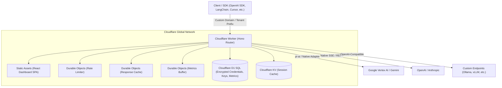

# Open LLM Proxy — Multi-Tenant LLM Gateway on Cloudflare Workers

A serverless, multi-tenant LLM gateway built on [Cloudflare Workers](https://www.cloudflare.com/developer-platform/products/workers/) that provides a unified, OpenAI-compatible proxy interface across multiple upstream Large Language Model (LLM) APIs.

---

## Key Capabilities

- **Unified OpenAI-Compatible Endpoints:** `/v1/chat/completions` and `/v1/models` route seamlessly to any configured upstream provider with full streaming (SSE) and tool calling support.
- **Multi-Tenant URL Prefixes & Custom Base URLs:** Each tenant receives an isolated base URL (e.g. `https://proxy.example.com/proxy_a1b2c3/v1`) or custom prefix so standard OpenAI SDKs require zero provider knowledge.
- **API Key Binding & Scopes:** Bind individual API keys to specific providers to allow bare model IDs (e.g. `gemini-2.5-flash`), enforce lifetime spend caps, and configure granular permissions.
- **Custom OpenAI-Compatible Providers:** Add self-hosted endpoints (e.g. Ollama, vLLM, LocalAI, OpenRouter, Groq) with custom base URLs, custom headers, and keyless options.
- **Provider API Key Management & In-Dashboard Testing:** Encrypted at rest in Cloudflare D1 with automatic multi-key rotation and live connection diagnostic probes.
- **Prompt & Response Cache Analytics:** Full visibility into upstream provider prompt-cache reads/writes (e.g. Claude Prompt Caching, Gemini Context Caching) and proxy-level duplicate request caching.
- **Token-Bucket Rate Limiting:** High-throughput request (RPM) and token (TPM) rate limiting backed by hash-sharded Cloudflare Durable Objects.
- **Embedded Admin Dashboard:** Responsive Single Page Application (SPA) served directly from Worker assets on the same custom domain (`/` and `/dashboard`).
- **Spend Tracking & Automated Alerting:** Per-tenant daily and monthly spend caps with automatic email and webhook alert dispatch.

---

## Supported Providers

| Provider                     | Modes Supported                                        | Streaming | Tool Calls                   | Prompt Caching     |
| ---------------------------- | ------------------------------------------------------ | --------- | ---------------------------- | ------------------ |
| **Google Vertex AI**         | Express Mode (API Key) & Service Account (OAuth2)      | ✅        | ✅ (with thought signatures) | ✅                 |
| **Google AI Studio**         | Native Gemini API Key                                  | ✅        | ✅                           | ✅                 |
| **OpenAI**                   | Standard API Key                                       | ✅        | ✅                           | ✅                 |
| **Anthropic**                | Standard API Key                                       | ✅        | ✅                           | ✅                 |
| **Custom OpenAI-Compatible** | Any baseUrl (Ollama, vLLM, OpenRouter, DeepSeek, etc.) | ✅        | ✅                           | Provider-dependent |

> **Google Vertex AI Auth Modes:**
>
> - **API Key (Vertex Express Mode):** Uses Google Cloud API Key with native `generateContent` protocol. Supports thought signature filtering and tool call execution.
> - **Service Account:** Uses GCP Project ID, location, and service account JSON to mint OAuth2 tokens against the Vertex OpenAI-compatible endpoint.

---

## Architecture



---

## Quick Start (Local Development)

### Prerequisites

- **Node.js:** `22.x` or later
- **npm:** `10.x` or later

### Installation & Local Dev

```bash
# 1. Clone repository
git clone https://github.com/your-org/open-llm-proxy.git
cd open-llm-proxy

# 2. Install dependencies
npm install
npm --prefix dashboard install

# 3. Build dashboard assets
npm run build:dashboard

# 4. Start local development server (Simulates D1, DO, KV)
npm run dev
```

Visit `http://localhost:8787` to open the local dashboard. Sign in with the seeded credentials:

```
admin@example.com / AwesomeProxy!!
```

_(You will be prompted to set a new admin password upon first login)._

---

## Deployment (Cloudflare Git Integration)

This repository is structured for **zero-leak public deployment**. No private domain names, production resource IDs, or secrets need to be committed to Git.

Refer to **[DEPLOYMENT.md](DEPLOYMENT.md)** for the complete guide on deploying via the Cloudflare Dashboard with automated GitHub CI/CD.

### Summary of Deployment Setup

1. **Cloudflare Dashboard → Workers & Pages → Connect to Git**
2. **Build Settings:**
   - Build command: `npm run build:dashboard`
   - Framework preset: `None`
3. **Bindings (Settings → Bindings):**
   - Bind D1 database `DB`
   - Bind KV namespace `SESSION_CACHE`
4. **Environment Variables (Settings → Variables and Secrets):**
   - `BASE_URL`: `https://proxy.yourdomain.com`
   - `DASHBOARD_URL`: `https://proxy.yourdomain.com`
   - `ENVIRONMENT`: `production`
5. **Custom Domain (Settings → Triggers → Custom Domains):**
   - Bind your domain (e.g. `proxy.yourdomain.com`).

---

## Usage Examples

### 1. OpenAI SDK (Bound API Key with Bare Model ID)

When using an API key bound to a default provider (e.g. `google-vertex`), send bare model IDs directly:

```python
from openai import OpenAI

client = OpenAI(
    api_key="proxy_sec_...",
    base_url="https://proxy.yourdomain.com/v1"
)

response = client.chat.completions.create(
    model="gemini-2.5-flash",
    messages=[{"role": "user", "content": "Explain quantum entanglement in 2 sentences."}],
    stream=True
)

for chunk in response:
    if chunk.choices[0].delta.content:
        print(chunk.choices[0].delta.content, end="")
```

### 2. cURL (Explicit Provider Routing)

For unbound keys, specify the provider in the model name (`provider/model`):

```bash
curl -X POST https://proxy.yourdomain.com/v1/chat/completions \
  -H "Authorization: Bearer proxy_sec_..." \
  -H "Content-Type: application/json" \
  -d '{
    "model": "anthropic/claude-3-7-sonnet-20250219",
    "messages": [{"role": "user", "content": "Hello!"}]
  }'
```

### 3. Dedicated Tenant Base URL

Tenants with a prefix can route without provider prefixes:

```bash
curl https://proxy.yourdomain.com/proxy_a1b2c3/v1/models \
  -H "Authorization: Bearer proxy_sec_..."
```

---

## Analytics & Cache Observability

The dashboard includes detailed tracking for LLM token usage and caching efficiency:

- **Prompt Cache Hit Rate:** Percentage of requests benefiting from provider prompt caching.
- **Cache Read vs. Write Tokens:** Differentiates tokens read from cache (billed at reduced rate) vs. tokens written.
- **Proxy Response Cache Hits:** Tracks exact duplicate requests served directly by Cloudflare Durable Objects with zero upstream latency.
- **Per-Request Cache Badges:** The **Analytics** page visualizes whether each individual request was a `response hit`, `prompt read`, or `cache write`.

---

## Testing & CI

Run the automated test suite locally:

```bash
# Run all backend unit & integration tests
npm run test

# Type check backend & frontend
npm run tsc
npm --prefix dashboard run build

# Run linter and formatting checks
npm run lint
npm run prettier-ci
```

---

## License

MIT
